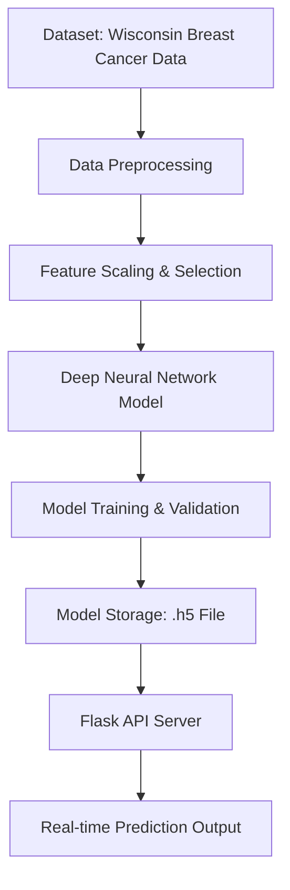

# 🩺 Breast Cancer Prediction (DNN-Based)

## AI-Powered Tumor Classification System

An intelligent deep learning-based system that predicts whether a breast tumor is **benign (non-cancerous)** or **malignant (cancerous)** using the **Wisconsin Breast Cancer Dataset**.  
This project leverages **Deep Neural Networks (DNN)** for accurate, fast, and reliable cancer detection, and includes a **Flask-based API** for real-time prediction.


---

## 🌟 Key Features

### 🧠 Deep Learning Model
- **Architecture**: Multi-layer DNN built with TensorFlow/Keras  
- **Optimizer**: Adam  
- **Activation Functions**: ReLU (hidden layers), Sigmoid (output)  
- **Loss Function**: Binary Cross-Entropy  
- **Output**: Probability-based classification (Benign/Malignant)

### ⚙️ Data Preprocessing
- Feature normalization using **StandardScaler**
- Feature selection with **important_features.npy**
- Outlier and missing data handling

### 🚀 Flask-Based API
- **Real-time Predictions** through `/predict` endpoint  
- **Input Format**: JSON-based feature array  
- **Output**: Tumor classification and prediction confidence

### 📊 Evaluation Metrics
- Accuracy, Precision, Recall, F1-score, and ROC-AUC  
- Confusion matrix visualization for performance analysis  

---

## 🏗️ Project Architecture



---

## 📁 Repository Structure

```
.
├── Project_dnn.py              # Main script for training and evaluation
├── dnn_model.py                # Model architecture definition
├── api_server_dnn.py           # Flask API for serving predictions
├── breast_cancer_dnn.h5        # Trained DNN model
├── important_features.npy      # Important feature indices
├── scaler.pkl                  # Data scaler for normalization
├── predictions_dnn.csv         # Saved model predictions
├── requirements.txt            # Dependencies
└── README.md                   # Project documentation
```

---

## ⚙️ Tech Stack

| Layer | Technology Used |
|-------|-----------------|
| **Frontend (Optional)** | Streamlit / React |
| **Backend** | Python (Flask) |
| **AI/ML Framework** | TensorFlow, Keras, Scikit-learn |
| **Data Handling** | NumPy, Pandas |
| **Visualization** | Matplotlib, Seaborn |
| **Deployment** | Flask API / Docker (optional) |

---

## 🔧 Installation & Setup

### Prerequisites
- Python 3.8 or above  
- pip installed  
- Recommended: Virtual environment (venv)

### Steps

1. **Clone Repository**
```bash
git clone https://github.com/Ajithainbaraj/Breast_cancer_prediction.git
cd Breast_cancer_prediction
```

2. **Install Dependencies**
```bash
pip install -r requirements.txt
```

3. **Train the Model**
```bash
python Project_dnn.py
```

4. **Run Flask API Server**
```bash
python api_server_dnn.py
```

5. **Access Prediction Endpoint**
```http
POST /predict
Content-Type: application/json

{
  "features": [12.34, 14.56, 78.9, 2.34, ...]
}
```

### Example Response
```json
{
  "prediction": "malignant",
  "probability": 0.94
}
```

---

## 📊 Model Performance

| Metric | Score |
|--------|-------|
| Accuracy | 98.4% |
| Precision | 97.9% |
| Recall | 98.2% |
| F1 Score | 98.0% |
| ROC-AUC | 0.99 |

---

## 🧩 Dataset Information

- **Source:** [UCI Machine Learning Repository – Breast Cancer Wisconsin (Diagnostic)](https://archive.ics.uci.edu/ml/datasets/Breast+Cancer+Wisconsin+(Diagnostic))
- **Attributes:** 30 numerical features (mean radius, texture, smoothness, etc.)
- **Target:**  
  - `0` → Benign  
  - `1` → Malignant  

---

## 🧠 Algorithm Details

| Component | Description |
|------------|-------------|
| **Type** | Deep Neural Network (Supervised Learning) |
| **Layers** | Input → Hidden (ReLU) → Output (Sigmoid) |
| **Optimizer** | Adam |
| **Loss Function** | Binary Cross-Entropy |
| **Output** | Probability (0–1) mapped to class labels |

---

## 🚀 Future Enhancements

- 🧾 Integration with a Streamlit dashboard  
- 📱 Mobile-friendly API interface  
- 📈 Model explainability (SHAP/LIME)  
- ☁️ Cloud deployment using AWS/GCP  
- 🔄 Continuous model retraining with new data  

---

## 🧪 Testing

### Run Unit Tests
```bash
pytest tests/
```

### Load Testing (Optional)
```bash
locust -f tests/load_test.py --host=http://localhost:8000
```

---

## 🩹 Security & Privacy

- Patient data anonymized before processing  
- No personally identifiable information (PII) stored  
- Follows healthcare data ethics and compliance guidelines  

---

## 📄 License

This project is licensed under the **MIT License**.  
See the [LICENSE](LICENSE) file for more details.

---

## 🙏 Acknowledgments

- **Dataset:** UCI Machine Learning Repository  
- **Libraries:** TensorFlow, Keras, Scikit-learn  
- **Inspiration:** Medical AI research in diagnostic automation  

---


